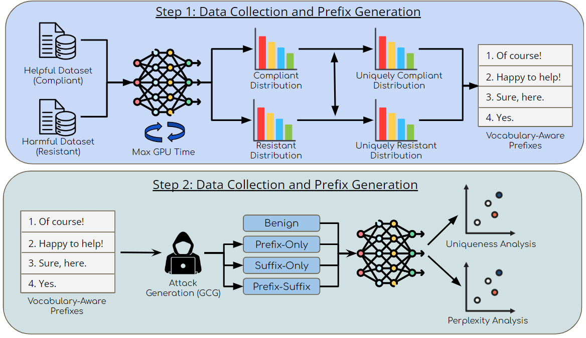

<h1>Vocabulary-Aware Prefix Jailbreaks for Aligned LLMs</h1>

Large language models (LLMs) have become powerful tools for generating coherent text across various domains. However, these models have been trained on massive datasets sourced from all over the Internet, including a mixture of helpful and potentially harmful content. Previous work has shown that prompt-based jailbreaks can induce malicious behavior in these models, namely the reproduction of harmful content. One standard method forces a model to include a fixed prefix “Sure, here” in its response, in theory making the following tokens more compliant. However, it remains unclear why this prefix is effective or if other prefixes might also succeed. We first build a list of vocabulary-aware prefixes by analyzing helpful and harmful datasets to find words that appear more often in compliant and resistant responses. Then, we test how well these prefixes work across several models(Llama-2-7b, Qwen-1.5B, Llama-3-8B) using both prefix-only and prefix-suffix attacks. We evaluate 20 prefixes across three models and 100 harmful phrases. We also examine how prefix uniqueness and perplexity relate to attack success rate. Our results show that some prefixes work better than “Sure, here,” but uniqueness and perplexity are unreliable predictors. Our best-performing prefix improves attack success rates by 1.3x on Qwen-1.5B, and by as high as 2.6x on Llama-3-8B.

<h2>Methodology</h2>

<h2>Code</h2>
We provide code for reproducing all experiments in this repository. We use Python 3.9.18. All other requirements are available in the requirements file.   

Collect compliant and resistant corpora for a given HuggingFace model:  
`sbatch collect.sbatch`  

Visualize unigram, bigram, and trigram distributions for compliant, resistant, and uniquely compliant and resistant frequencies:  
`sandbox.ipynb`  

Evaluate a subset of the AdvBench dataset on a given model:  
Config:  
`config.ini`  
Script:  
`sbatch evaluate.sbatch`

For details on methods, experiments, and results, please see our final report.
